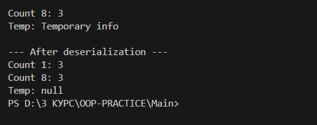

# Завдання 2

# 1. Розробити клас, що серіалізується, для зберігання параметрів і результатів обчислень. Використовуючи агрегування, розробити клас для знаходження рішення
задачі. 
# 2. Розробити клас для демонстрації в діалоговому режимі збереження та відновлення стану об'єкта, використовуючи серіалізацію. Показати особливості використання transient полів. 
# 3. Розробити клас для тестування коректності результатів обчислень та серіалізації/десеріалізації. Використовувати докладні коментарі для автоматичної генерації документації засобами javadoc.
## 10. Підрахувати кількість 16-річних та 8-річних цифр у заданому значенні десяткового числа.

## Код

[Переглянути код](../src/task2.java)
