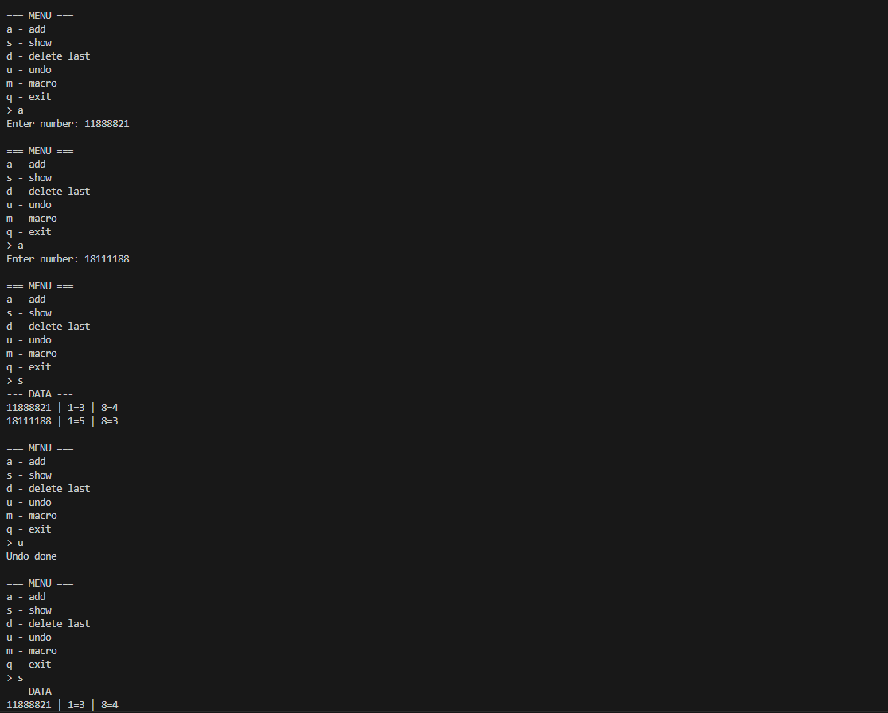

# Завдання 5

## 1. Реалізувати можливість скасування (undo) операцій (команд).

## 2. Продемонструвати поняття "макрокоманда"

## 3.При розробці програми використовувати шаблон Singletone.

## 4. Забезпечити діалоговий інтерфейс із користувачем.

## 5.Розробити клас для тестування функціональності програми.

## Код

[Переглянути код](../src/task5.java)